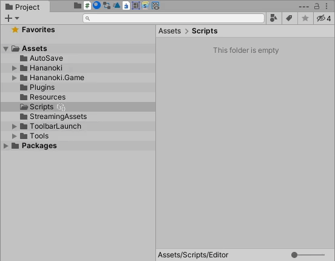
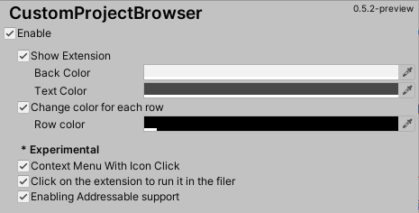

# Custom Project Browser


[Japanese](https://translate.google.com/translate?sl=en&tl=ja&u=https://github.com/hananoki/CustomProjectBrowser) (by Google Translate)

## Overview
- A simple customized project browser 

## Installation
- Add following lines to the `dependencies` section of the `Packages/manifest.json`.
```js
"dependencies": {
  "com.hananoki.custom-project-browser": "https://github.com/hananoki/CustomProjectBrowser.git",
  "com.hananoki.shared-module": "https://github.com/hananoki/SharedModule.git",
  ...
}
```

## Description






## Requirement
[](https://github.com/hananoki/SharedModule)

## Licence

[MIT](https://github.com/hananoki/CustomHierarchy/blob/master/LICENSE.md)